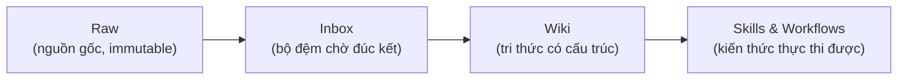
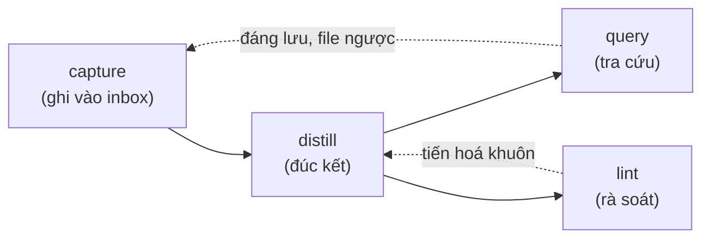

# Knowhow System

> Biến mỗi dự án thành một kho tri thức tích luỹ có cấu trúc. AI viết, người duyệt.

Knowhow System là bộ skills cho AI Agent giúp ghi nhận, đúc kết và duy trì tri thức tích luỹ trong suốt vòng đời một dự án. Mỗi dự án tự chứa knowhow riêng trong thư mục `.knowhow/`, dạng markdown thuần, để mọi agent đọc được và mọi commit theo dõi được.

## Vấn đề

Kiến thức sinh ra trong lúc làm việc (cách giải quyết vấn đề, quyết định kiến trúc, pattern hiệu quả, bài học từ lỗi) thường biến mất sau mỗi phiên trao đổi với AI. Không có cơ chế để:

- Ghi nhận knowhow một cách có hệ thống.
- Đúc kết thành skill/workflow tái sử dụng.
- Để AI Agent tự học từ knowhow đã tích luỹ.

Mỗi lần mở lại dự án là một lần bắt đầu từ con số không.

## Giải pháp

Một hệ thống **3 lớp dữ liệu** + **6 skills vận hành**, cài vào bất kỳ dự án nào (code hoặc không code). Knowhow đi qua một cửa duy nhất là `inbox/`, rồi được đúc kết thành tri thức có cấu trúc, được rà soát định kỳ, và tự tiến hoá khuôn khi dự án lớn lên.

Lấy cảm hứng từ:

- **LLM Wiki** (Karpathy): wiki là "persistent, compounding artifact", AI viết và duy trì, người curate và hỏi đúng câu hỏi.
- **SOP Framework v2.0** (Minh Đỗ): đóng gói quy trình ở mức thao tác, có WHY, có ngoại lệ, có vòng phản hồi.

## Phục vụ chung (từ vựng)

Bộ skill dùng được cho cả người làm kỹ thuật lẫn không kỹ thuật. Vài từ dưới đây là tương đương, chỉ cùng một thứ:

| Từ trung lập | Người kỹ thuật hiểu là | Người cá nhân hiểu là |
|---|---|---|
| Kho tri thức | Repo dự án | Thư mục tài liệu của bạn |
| Không gian làm việc | Project root | Thư mục gốc đang làm |
| Hoàn tác (reversible) | `git revert` | Lấy lại từ `archive/` |

## Điểm nổi bật

- **Markdown thuần, agent-agnostic.** Sản phẩm knowhow là markdown, mọi agent đọc được, commit vào repo cùng code.
- **AI đề xuất, người duyệt.** Không bước nào tự động ghi vào tri thức chính thức. User duyệt từng item.
- **Một cửa duy nhất.** Mọi knowhow vào `inbox/` trước, không ghi thẳng vào wiki/skills/workflows. Bất biến này giữ tri thức nhất quán.
- **Ưu tiên cải tiến hơn tạo mới.** Distill luôn đọc cái đã có trước, gộp tri thức thay vì phân mảnh.
- **Khuôn tự tiến hoá.** Hệ thống tích luỹ tín hiệu "khuôn không vừa" rồi đề xuất thay đổi cấu trúc khi vượt ngưỡng.
- **Mọi thay đổi reversible (kép).** Lớp gốc không cần công cụ: không xoá cứng, mọi thao tác phá huỷ (rút page, gộp, nghỉ hưu) đi qua `archive/` + trạng thái `status` nên luôn lấy lại được. Khi không gian làm việc có git, `git revert` là lớp an toàn cộng thêm.

## Kiến trúc

Tri thức chảy qua 3 lớp, từ thô đến thực thi được:



| Lớp           | Ai viết                 | Mục đích                                        |
| ------------- | ----------------------- | ----------------------------------------------- |
| **Raw**       | Người / import          | Nguyên liệu thô, không sửa                      |
| **Wiki**      | AI viết, người duyệt    | Tri thức có cấu trúc, liên kết chéo             |
| **Skills**    | AI đề xuất, người duyệt | Thao tác cụ thể, làm-theo-được, tái sử dụng cao |
| **Workflows** | AI đề xuất, người duyệt | Chuỗi bước, gắn domain, gọi nhiều skill         |

Hệ thống chia làm hai tầng tách biệt:

| Tầng                    | Sống ở đâu          | Vai trò                              |
| ----------------------- | ------------------- | ------------------------------------ |
| **Skills vận hành**     | Config của agent    | Công cụ xây dựng và duy trì knowhow  |
| **Sản phẩm knowhow**    | `.knowhow/` trong repo | Kiến thức dự án, mọi agent đọc được |

## 6 skills vận hành

| Skill | Làm gì | Khi nào dùng |
|-------|--------|--------------|
| **knowhow-init** | Tạo cấu trúc `.knowhow/`, sinh SCHEMA, gắn hướng dẫn vào config agent | Bắt đầu dự án mới, hoặc thêm knowhow vào dự án sẵn có |
| **knowhow-capture** | Quét hội thoại/file, nhận diện knowhow, ghi candidate vào `inbox/` | Sau phiên làm việc, hoặc khi muốn lưu một bài học |
| **knowhow-distill** | Đúc kết `inbox/` thành wiki page / skill / workflow, ưu tiên cập nhật cái cũ | Khi inbox có nội dung chờ |
| **knowhow-lint** | Rà soát sức khoẻ hệ thống, 4 chế độ: quick, consolidation, rebuild-index, schema-review | Định kỳ, hoặc khi knowhow đã tích luỹ nhiều |
| **knowhow-query** | Trả lời câu hỏi từ knowhow, trích dẫn `[[slug]]`, phát tín hiệu khi không trúng page | Khi cần tra cứu tri thức đã tích luỹ |
| **knowhow-run** | Tiêu thụ skill/workflow đã đúc kết: tra registry → load file bó → làm theo. Không ghi vào `.knowhow/` | Khi bắt đầu task domain cần làm theo một bó đã có |

## Cấu trúc `.knowhow/`

```
.knowhow/
├── SCHEMA.md              # Quy ước + hướng dẫn cho agent (đọc đầu tiên)
├── schema-signals.md      # Sổ tín hiệu "khuôn không vừa" cho schema-review
├── raw/                   # Lớp 1: nguồn thô, immutable
├── inbox/                 # Bộ đệm: chờ đúc kết, chưa phân loại
├── archive/               # Kho phục hồi: page rút khỏi wiki + inbox đã dọn (archive/inbox/)
├── wiki/                  # Lớp 2: tri thức có cấu trúc
│   ├── index.md           # Mục lục toàn bộ wiki
│   ├── log.md             # Nhật ký hoạt động (append-only)
│   ├── decision-*.md      # Quyết định + lý do + bối cảnh
│   ├── pattern-*.md       # Pattern đã chứng minh hiệu quả
│   ├── concept-*.md       # Thuật ngữ, khái niệm riêng dự án
│   └── troubleshooting-*.md  # Sự cố đã gặp + cách xử lý
├── skills/                # Lớp 3a: skill (làm-theo-được, tái sử dụng)
│   └── registry.md        # Danh sách skill + metadata
└── workflows/             # Lớp 3b: workflow (nhiều bước, gọi skill)
    └── registry.md        # Danh sách workflow + metadata
```

## Bắt đầu

> [!NOTE]
> Cả 6 skill vận hành lẫn sản phẩm knowhow (`.knowhow/`) đều là markdown thuần, không gắn với AI agent cụ thể nào. Mọi agent (Claude Code, Codex, Gemini, ...) đều **đọc** knowhow và **chạy** được capture/distill/lint/query/run.

### 1. Khởi tạo

Gọi `knowhow-init`. Skill hỏi tên dự án và mô tả domain, rồi:

- Tạo toàn bộ cây thư mục `.knowhow/`.
- Sinh `SCHEMA.md` với quy ước mặc định.
- Thêm mục hướng dẫn vào `CLAUDE.md` / `AGENTS.md` / `GEMINI.md` (file nào tồn tại trước, hoặc tạo `CLAUDE.md` mới).

### 2. Vòng lặp tích luỹ



- **capture**: sau một phiên làm việc, ghi nhận quyết định, pattern, bài học vào `inbox/`.
- **distill**: chuyển inbox thành wiki page / skill / workflow chính thức. Luôn đọc cái đã có trước để gộp thay vì tạo trùng.
- **query**: hỏi knowhow đã tích luỹ, nhận câu trả lời kèm trích dẫn nguồn.
- **lint**: định kỳ rà soát link hỏng, page mồ côi, mâu thuẫn nội dung, và đề xuất tiến hoá khuôn.

### 3. Onboard agent mới

`knowhow-init` gắn một khối hướng dẫn vào file config agent (`CLAUDE.md` / `AGENTS.md` / `GEMINI.md`), liệt kê 4 file bản đồ tri thức để agent đọc ngay đầu mỗi phiên:

- `SCHEMA.md` (quy ước)
- `wiki/index.md` (mục lục)
- `skills/registry.md` và `workflows/registry.md` (cái gì dùng được)

Khối hướng dẫn này yêu cầu agent đọc 4 file bản đồ ngay đầu phiên, không phụ thuộc cơ chế auto-load riêng của từng agent, nên dùng được cho mọi agent. Chỉ bản đồ được đọc sẵn; nội dung chi tiết (wiki page, skill/workflow bó) load on-demand qua `knowhow-query` / `knowhow-run` khi cần.

## Tiến hoá cấu trúc (schema evolution)

Khuôn không cố định mà tự lớn theo dự án:

1. `distill` và `query` phát hiện "khuôn không vừa" (loại tri thức mới, section lặp, câu hỏi không trúng page) thì ghi tín hiệu vào `schema-signals.md`. Chúng **không** tự đổi khuôn.
2. `knowhow-lint schema-review` đọc sổ tín hiệu, quét trạng thái sống, áp ngưỡng, rồi đề xuất diff lên `SCHEMA.md`.
3. User duyệt từng đề xuất.
4. Hệ thống migrate file bị ảnh hưởng, rewrite link, rebuild index, bump `schema_version`.

Bốn loại thay đổi cấu trúc: thêm page type mới, đổi layout (subfolder), đổi format của một type, thêm mục vào SCHEMA. Tất cả gate qua user, không bao giờ auto-migrate.

## Cấu trúc kho mã

```
.
├── skills/
│   ├── knowhow-init/      # SKILL.md + references (schema-template, agent-config-snippet)
│   ├── knowhow-capture/   # SKILL.md + references (page-formats)
│   ├── knowhow-distill/   # SKILL.md
│   ├── knowhow-lint/      # SKILL.md + references (schema-review, consolidation-checklist)
│   ├── knowhow-query/     # SKILL.md
│   └── knowhow-run/       # SKILL.md
└── docs/
    └── superpowers/       # Spec thiết kế + plan triển khai
```
