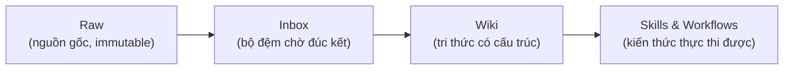
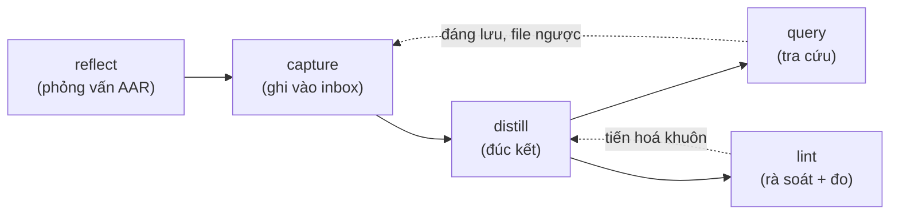

# Knowhow System

> Biến mọi không gian làm việc thành một kho tri thức tích luỹ có cấu trúc. AI viết, người duyệt.

Knowhow System là bộ skills cho AI Agent giúp ghi nhận, đúc kết và duy trì tri thức tích luỹ trong suốt vòng đời một kho tri thức. Mỗi kho tự chứa knowhow riêng trong thư mục `.knowhow/`, dạng markdown thuần, để mọi agent đọc được và mọi thay đổi theo dõi được.

## Vấn đề

Kiến thức sinh ra trong lúc làm việc (cách giải quyết vấn đề, quyết định kiến trúc, pattern hiệu quả, bài học từ lỗi) thường biến mất sau mỗi phiên trao đổi với AI. Không có cơ chế để:

- Ghi nhận knowhow một cách có hệ thống.
- Đúc kết thành skill/workflow tái sử dụng.
- Để AI Agent tự học từ knowhow đã tích luỹ.

Mỗi lần mở lại kho là một lần bắt đầu từ con số không.

## Giải pháp

Một hệ thống **3 lớp dữ liệu** + **7 skills vận hành**, cài vào bất kỳ không gian làm việc nào (code hoặc không code). Knowhow đi qua một cửa duy nhất là `inbox/`, rồi được đúc kết thành tri thức có cấu trúc, được rà soát định kỳ, và tự tiến hoá khuôn khi kho lớn lên.

Lấy cảm hứng từ:

- **LLM Wiki** (Karpathy): wiki là "persistent, compounding artifact", AI viết và duy trì, người curate và hỏi đúng câu hỏi.
- **SOP Framework v2.0** (Minh Đỗ): đóng gói quy trình ở mức thao tác, có WHY, có ngoại lệ, có vòng phản hồi.

## Phục vụ chung (từ vựng)

Bộ skill dùng được cho cả người làm kỹ thuật lẫn không kỹ thuật. Vài từ dưới đây là tương đương, chỉ cùng một thứ:

| Từ trung lập          | Người kỹ thuật hiểu là | Người cá nhân hiểu là    |
| --------------------- | ---------------------- | ------------------------ |
| Kho tri thức          | Repo dự án             | Thư mục tài liệu của bạn |
| Không gian làm việc   | Project root           | Thư mục gốc đang làm     |
| Hoàn tác (reversible) | `git revert`           | Lấy lại từ `archive/`    |


## Điểm nổi bật

- **Markdown thuần, agent-agnostic.** Sản phẩm knowhow là markdown, mọi agent đọc được, lưu cùng nguồn gốc công việc.
- **AI đề xuất, người duyệt.** Không bước nào tự động ghi vào tri thức chính thức. User duyệt từng item. (Sổ sách dẫn xuất là ngoại lệ có chủ đích: index/registry/log do agent tự đồng bộ và báo lại, vì chúng sinh ra từ tri thức chứ không phải tri thức.)
- **Một cửa duy nhất.** Mọi knowhow vào `inbox/` trước, không ghi thẳng vào wiki/skills/workflows. Bất biến này giữ tri thức nhất quán.
- **Ưu tiên cải tiến hơn tạo mới.** Distill luôn đọc cái đã có trước, gộp tri thức thay vì phân mảnh.
- **Khuôn tự tiến hoá.** Hệ thống tích luỹ tín hiệu "khuôn không vừa" rồi đề xuất thay đổi cấu trúc khi vượt ngưỡng.
- **Mọi thay đổi reversible (kép).** Lớp gốc không cần công cụ: không xoá cứng, mọi thao tác phá huỷ (rút page, gộp, nghỉ hưu) đi qua `archive/` + trạng thái `status` nên luôn lấy lại được. Khi không gian làm việc có git, `git revert` là lớp an toàn cộng thêm.

## Kiến trúc

Tri thức chảy qua 3 lớp, từ thô đến thực thi được:



| Lớp           | Ai viết                 | Mục đích                                        |
| ------------- | ----------------------- | ----------------------------------------------- |
| **Raw**       | Người / import          | Nguyên liệu thô, không sửa                      |
| **Wiki**      | AI viết, người duyệt    | Tri thức có cấu trúc, liên kết chéo             |
| **Skills**    | AI đề xuất, người duyệt | Thao tác cụ thể, làm-theo-được, tái sử dụng cao |
| **Workflows** | AI đề xuất, người duyệt | Chuỗi bước, gắn domain, gọi nhiều skill         |


Hệ thống chia làm hai tầng tách biệt:

| Tầng                 | Sống ở đâu            | Vai trò                               |
| -------------------- | --------------------- | ------------------------------------- |
| **Skills vận hành**  | Config của agent      | Công cụ xây dựng và duy trì knowhow   |
| **Sản phẩm knowhow** | `.knowhow/` trong kho | Kiến thức của kho, mọi agent đọc được |


## 7 skills vận hành

| Skill               | Làm gì                                                                                                                                                                    | Khi nào dùng                                                 |
| ------------------- | ------------------------------------------------------------------------------------------------------------------------------------------------------------------------- | ------------------------------------------------------------ |
| **knowhow-init**    | Tạo cấu trúc `.knowhow/`, sinh SCHEMA, gắn hướng dẫn vào config agent                                                                                                     | Bắt đầu một kho mới, hoặc thêm knowhow vào không gian sẵn có |
| **knowhow-capture** | Quét hội thoại/file, nhận diện knowhow, ghi candidate vào `inbox/`. Nguồn lớn (transcript, export chat, loạt issue): chế độ batch ingest, duyệt theo nhóm                 | Sau phiên làm việc, hoặc khi muốn lưu một bài học            |
| **knowhow-reflect** | Phỏng vấn phản tư (AAR): kỳ vọng, thực tế, nguyên nhân gốc, bài học, hành động hệ thống. Kết quả đổ về flow capture                                                       | Sau sự cố, sau milestone, cuối dự án, hoặc retro định kỳ     |
| **knowhow-distill** | Đúc kết `inbox/` thành wiki page / skill / workflow, ưu tiên cập nhật cái cũ                                                                                              | Khi inbox có nội dung chờ                                    |
| **knowhow-lint**    | Rà soát sức khoẻ hệ thống, 6 chế độ: quick, consolidation, rebuild-index, schema-review, restore, metrics                                                                 | Định kỳ, hoặc khi knowhow đã tích luỹ nhiều                  |
| **knowhow-query**   | Trả lời câu hỏi từ knowhow, trích dẫn `[[slug]]`, phát tín hiệu khi không trúng page. Chế độ teach: soạn lộ trình đọc onboarding từ wiki                                  | Khi cần tra cứu tri thức đã tích luỹ, hoặc đào tạo người mới |
| **knowhow-run**     | Tiêu thụ skill/workflow đã đúc kết: tra registry → load file bó → làm theo. Không sản xuất tri thức, chỉ ghi 1 dòng usage log + 1 tín hiệu promote khi làm theo wiki page | Khi bắt đầu task domain cần làm theo một bó đã có            |


## Cấu trúc `.knowhow/`

```
.knowhow/
├── SCHEMA.md              # Quy ước + hướng dẫn cho agent (đọc đầu tiên)
├── schema-signals.md      # Sổ tín hiệu "khuôn không vừa" cho schema-review
├── raw/                   # Lớp 1: nguồn thô, immutable
├── inbox/                 # Bộ đệm: chờ đúc kết, chưa phân loại
├── archive/               # Kho phục hồi: page rút khỏi wiki + inbox đã dọn (archive/inbox/)
├── wiki/                  # Lớp 2: tri thức có cấu trúc
│   ├── index.md           # Mục lục toàn bộ wiki
│   ├── log.md             # Nhật ký hoạt động (append-only)
│   ├── decision-*.md      # Quyết định + lý do + bối cảnh
│   ├── pattern-*.md       # Pattern đã chứng minh hiệu quả
│   ├── concept-*.md       # Thuật ngữ, khái niệm riêng của kho
│   ├── troubleshooting-*.md  # Sự cố đã gặp + cách xử lý
│   ├── lesson-*.md        # Bài học phản tư: kỳ vọng vs thực tế + hành động hệ thống
│   └── project-*.md       # (tuỳ chọn) Trang thực thể dự án, neo tri thức cùng dự án
├── skills/                # Lớp 3a: skill (làm-theo-được, tái sử dụng)
│   └── registry.md        # Danh sách skill + metadata
└── workflows/             # Lớp 3b: workflow (nhiều bước, gọi skill)
    └── registry.md        # Danh sách workflow + metadata
```

## Bắt đầu

### 1. Khởi tạo

Gọi `knowhow-init`. Skill hỏi tên kho, mô tả lĩnh vực, và kho có làm việc theo dự án không (nếu có thì seed thêm type `project`), rồi:

- Tạo toàn bộ cây thư mục `.knowhow/`.
- Sinh `SCHEMA.md` với quy ước mặc định.
- Thêm khối hướng dẫn (bọc trong marker `<!-- knowhow:start/end -->`) vào `AGENTS.md` (tạo mới nếu chưa có). Config agent khác user tự gắn.

### 2. Vòng lặp tích luỹ



- **reflect**: sau sự cố hoặc cuối dự án, phỏng vấn 5 câu để moi tri thức ngầm thành chữ, rồi bàn giao cho capture.
- **capture**: sau một phiên làm việc, ghi nhận quyết định, pattern, bài học vào `inbox/`.
- **distill**: chuyển inbox thành wiki page / skill / workflow chính thức. Luôn đọc cái đã có trước để gộp thay vì tạo trùng.
- **query**: hỏi knowhow đã tích luỹ, nhận câu trả lời kèm trích dẫn nguồn.
- **lint**: định kỳ rà soát link hỏng, page mồ côi, mâu thuẫn nội dung, đo mức sử dụng (metrics), và đề xuất tiến hoá khuôn.

### 3. Onboard agent mới

`knowhow-init` gắn một khối hướng dẫn vào `AGENTS.md` (bọc trong marker `<!-- knowhow:start/end -->` để re-init cập nhật được tại chỗ), nêu vai trò bộ skill knowhow trong quản trị tri thức và dùng cú pháp `@` để agent tự nạp 4 file bản đồ vào context đầu mỗi phiên:

- `@.knowhow/SCHEMA.md` (quy ước)
- `@.knowhow/skills/registry.md` và `@.knowhow/workflows/registry.md` (cái gì dùng được)
- `@.knowhow/wiki/index.md` (mục lục)

Chỉ bản đồ được nạp sẵn; nội dung chi tiết (wiki page, skill/workflow bó) load on-demand qua `knowhow-query` / `knowhow-run` khi cần.

## Tiến hoá cấu trúc (schema evolution)

Khuôn không cố định mà tự lớn theo kho:

1. `distill` và `query` phát hiện "khuôn không vừa" (loại tri thức mới, section lặp, câu hỏi không trúng page) thì ghi tín hiệu vào `schema-signals.md`. Chúng **không** tự đổi khuôn.
2. `knowhow-lint schema-review` đọc sổ tín hiệu, quét trạng thái sống, áp ngưỡng, rồi đề xuất diff lên `SCHEMA.md`.
3. User duyệt từng đề xuất.
4. Hệ thống migrate file bị ảnh hưởng, rewrite link, rebuild index, bump `schema_version`.

Bốn loại thay đổi cấu trúc: thêm page type mới, đổi layout (subfolder), đổi format của một type, thêm mục vào SCHEMA. Tất cả gate qua user, không bao giờ auto-migrate.

## Cấu trúc kho mã

```
.
├── skills/
│   ├── knowhow-init/      # SKILL.md + references (schema-template, agent-config-snippet)
│   ├── knowhow-capture/   # SKILL.md + references (page-formats, batch-ingest)
│   ├── knowhow-reflect/   # SKILL.md
│   ├── knowhow-distill/   # SKILL.md
│   ├── knowhow-lint/      # SKILL.md + references (schema-review, consolidation-checklist)
│   ├── knowhow-query/     # SKILL.md
│   └── knowhow-run/       # SKILL.md
└── docs/
    └── superpowers/       # Spec thiết kế + plan triển khai
```
