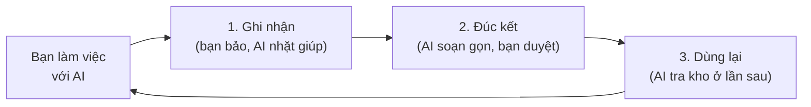

# Ghi Chú Ý Tưởng Sản Phẩm: Hệ Thống Tích Luỹ Bí Quyết

> Biến bí quyết của bạn thành tài sản mà AI dùng lại được.

## 1. Tóm tắt nhanh

Khi bạn làm việc với AI, những bí quyết quý nhất của bạn cứ trôi đi sau mỗi lần. Sản phẩm này giữ chúng lại. Nó biến kinh nghiệm và cách làm riêng của bạn thành một kho tri thức mà AI dùng lại được, dày thêm sau mỗi lần bạn duyệt. AI lo phần ghi chép và sắp xếp, bạn chỉ duyệt. Kết quả: thôi dạy lại AI từ đầu mỗi lần, và càng làm nhiều, bạn càng được đỡ việc nhiều hơn.

## 2. Vấn đề

Bạn có một kho bí quyết giá trị: cách bạn làm việc, những mẹo đã đúc kết, các quy trình chỉ riêng bạn biết. Đó là thứ làm nên chất lượng công việc của bạn. Nhưng kho ấy đang thất thoát mỗi ngày, theo ba cách.

**Bí quyết bốc hơi sau mỗi lần làm việc với AI.** Bạn mất công chỉ cho AI cách làm đúng ý mình: bối cảnh, yêu cầu, gu riêng. Nó làm tốt. Rồi bạn đóng cửa sổ chat. Lịch sử có thể còn đó, nhưng AI không tự dùng lại, nên lần sau bạn vẫn phải dạy lại từ đầu. Mỗi phiên là một lần bắt đầu gần như từ con số không.

**Kinh nghiệm nằm trong đầu, không lấy ra được.** Những gì giá trị nhất của bạn đang ở dạng ngầm: bạn "cảm" được phải làm thế nào, nhưng chưa bao giờ viết ra thành quy trình rõ ràng. Vì chưa thành chữ, không ai dùng lại được. Kể cả AI, kể cả chính bạn trong tương lai.

**Kiến thức rải rác khắp nơi.** Một mẹo trong ghi chú điện thoại. Một câu lệnh hay từng gõ cho AI, nằm đâu đó trong lịch sử chat. Một quy trình trong file Word nào đó. Khi cần, bạn không nhớ nó nằm ở đâu, nên lại làm lại từ đầu cho nhanh.

Gốc của cả ba là một điều: **bạn không có nơi để tích luỹ bí quyết thành tài sản dùng lại được.** Càng làm nhiều, bạn càng tạo ra nhiều hiểu biết giá trị. Nhưng thay vì cộng dồn, chúng cứ trôi đi. Bạn giỏi lên, nhưng công cụ của bạn thì không.

## 3. Ý tưởng sản phẩm

**Một nơi để bí quyết của bạn được ghi lại, gom gọn và để AI dùng lại, lớn lên theo thời gian.**

Hãy hình dung mỗi lần bạn làm việc với AI đều để lại một điểm đáng giữ: một quyết định hay, một mẹo, một cách xử lý tình huống. Thay vì để nó trôi đi, sản phẩm này giữ lại, sắp xếp gọn gàng, rồi đưa trở lại cho AI dùng ở lần sau. Bí quyết của bạn từ thứ vô hình trở thành tài sản nắm được trong tay.

**Càng dùng càng giàu, không trôi đi.** Đây là điểm khác biệt cốt lõi. Mỗi lần làm việc lại bồi thêm một chút vào kho. Tuần sau giàu hơn tuần này, tháng sau giàu hơn tháng trước. Bạn không xây lại từ đầu mỗi lần, bạn đứng trên nền những gì đã tích luỹ.

**Sống ngay trong chỗ bạn đã làm việc.** Đây không phải một app nặng nề phải học và mở mỗi sáng. Sau khi dựng một lần, nó nằm sẵn ngay nơi bạn vốn trò chuyện với AI. Bạn cứ làm việc như thường ngày, kho bí quyết dày lên mỗi lần bạn ghi lại và duyệt.

## 4. Cách nó vận hành

Đơn giản như ba bước, lặp lại tự nhiên trong lúc bạn làm việc.

**Bước 1, Ghi nhận.** Cuối buổi, bạn bảo một câu, AI rà lại và nhặt ra những điều đáng giữ: một quyết định, một mẹo, một bài học. Bạn không phải tự nhớ ghi lại.

**Bước 2, Đúc kết.** AI sắp xếp những mẩu đó thành tri thức gọn gàng, dễ tra. Trước khi bất cứ thứ gì được lưu chính thức, bạn xem và gật đầu. Bạn luôn là người quyết định cuối cùng, không có gì tự ý ghi vào kho.

**Bước 3, Dùng lại.** Lần sau cần đến, AI tìm ngay trong kho bí quyết này để làm đúng gu của bạn. Càng nhiều lần lặp, kho càng dày, AI càng có nhiều nền của bạn để dựa vào.

Điểm cần nhớ: **AI làm phần nặng nhọc, bạn giữ quyền kiểm soát.** Bạn không phải ngồi viết tài liệu, chỉ cần duyệt.

## 5. Giá trị bạn nhận được

Ba nỗi đau ở đầu tài liệu, giải quyết trực tiếp. Đây là điều bạn thấy khác đi sau khi dùng.

**Thôi dạy lại AI từ đầu mỗi lần.** Bí quyết bạn từng chỉ cho AI giờ được giữ lại, sẵn để đưa trở lại ở lần sau.

- *Trước*: mỗi phiên mới, bạn lại gõ lại bối cảnh, yêu cầu, gu riêng. Mất công, dễ sót.
- *Sau*: AI đã có sẵn nền của bạn. Bạn bắt đầu từ chỗ lần trước dừng, không phải số không.

**Kinh nghiệm trong đầu thành chữ dùng được.** Những gì bạn vốn chỉ "cảm" được, nay thành tri thức rõ ràng, nằm ngoài đầu bạn.

- *Trước*: bí quyết là thứ ngầm, chỉ bạn biết, không ghi ra, không giao cho ai được.
- *Sau*: AI giúp rút nó thành chữ, sắp gọn gàng. Bạn chỉ việc đọc và gật đầu, không phải ngồi viết.

**Một kho duy nhất, hết cảnh rải rác.** Mọi bí quyết về chung một chỗ, có lối tra cứu rõ ràng.

- *Trước*: mẹo ở ghi chú điện thoại, câu lệnh hay từng gõ cho AI nằm trong lịch sử chat, quy trình ở file Word. Cần là không tìm thấy.
- *Sau*: hỏi một câu, AI tra đúng kho của bạn và trả lời kèm nguồn. Không còn lục tung nhiều nơi.

Gộp lại, giá trị lớn nhất là một sự đảo chiều: **thời gian từ kẻ thù thành bạn đồng hành.** Trước đây càng làm nhiều, hiểu biết càng trôi đi. Giờ càng làm nhiều, kho của bạn càng dày, và bạn càng đỡ việc.

## 6. Dùng thử thế nào

Bắt đầu nhẹ nhàng, không cần đảo lộn cách bạn đang làm. Một vòng thử trông như sau.

1. **Dựng kho một lần (có người hướng dẫn).** Tạo một kho bí quyết trống, là một thư mục ngay trên máy bạn. Riêng việc dựng này làm một lần rồi thôi, các buổi sau bạn không phải đụng tới nó nữa.
2. **Làm việc như thường ngày.** Vài buổi bạn dùng AI cho công việc thật của mình, không phải làm gì khác đi.
3. **Cuối buổi, bảo AI "ghi lại".** AI nhặt ra những điều đáng giữ và cho bạn duyệt. Bạn gật hoặc bỏ.
4. **Lần sau, thấy khác biệt.** Bạn hỏi hoặc nhờ AI làm tiếp. Lần này nó dựa vào bí quyết bạn đã lưu để làm đúng gu hơn.

**Bạn cần gì để bắt đầu:** một thư mục làm việc trên máy bạn và một trợ lý AI bạn đang dùng. Không phần mềm nặng nề, không khoá hợp đồng. Phần dựng kho ban đầu có người hướng dẫn, bạn không phải tự lo kỹ thuật. Tri thức sinh ra là của bạn, ở dạng file văn bản đọc được bằng ứng dụng thông thường, mang đi đâu cũng được.

**Bí quyết của bạn nằm ở đâu:** kho là các file văn bản nằm trong một thư mục ngay trên máy bạn, như thư mục Tài liệu, không phải trên máy chủ của chúng tôi. Bạn toàn quyền xem, sửa, xoá, mang đi. Nói rõ cho minh bạch: khi AI đọc và soạn giúp, nội dung vẫn đi qua trợ lý AI bạn chọn, giống như mọi lần bạn trò chuyện với nó. Sản phẩm này không thêm một nơi lưu trữ bên thứ ba nào.

**Bao lâu thấy kết quả:** bạn thấy tín hiệu đầu ngay ở vòng thứ hai, khi AI dùng lại đúng cái bạn vừa lưu. Khác biệt rõ dần lên, thường thấy rõ sau một đến hai tuần.

**Đề xuất:** chọn một loại việc bạn làm lặp đi lặp lại, thử trong một, hai tuần. Đó là nơi giá trị hiện ra nhanh nhất, vì mỗi lần lặp là một lần kho bí quyết đỡ việc cho bạn.