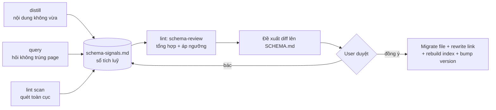

# Knowhow System: Tiến Hoá Cấu Trúc (Schema Evolution) — Spec v1.2

**Ngày**: 2026-06-05
**Phiên bản**: v1.2
**Quan hệ**: Bổ sung cho [2026-06-05-knowhow-system-design.md](2026-06-05-knowhow-system-design.md) v1.0 và [2026-06-05-knowhow-system-review-v1.1.md](2026-06-05-knowhow-system-review-v1.1.md). File này KHÔNG thay thế spec gốc, chỉ thêm năng lực mới: làm khuôn (`SCHEMA.md`) tự tiến hoá theo dự án.
**Trạng thái**: Thiết kế đã duyệt qua brainstorming, chờ viết plan.

## La bàn

v1.0/v1.1 tự cải tiến NỘI DUNG (page tích luỹ, confidence lên, consolidation gộp) nhưng KHÔNG tự cải tiến CẤU TRÚC. SCHEMA.md đẻ một lần lúc init rồi đứng yên, giống nhau cho mọi dự án. Nhưng mỗi kiểu dự án cần khuôn khác: dự án nghiên cứu cần type `experiment`/`source`, dự án vận hành cần `runbook`/`incident`.

Spec này thêm một vòng lặp tiến hoá *bên trên* cơ chế có sẵn: distill và query phát hiện "khuôn không vừa", lint tổng hợp và đề xuất sửa khuôn, user duyệt, hệ thống migrate. Khuôn tự mọc đúng hình theo từng dự án.

## Lõi vấn đề (đọc trước)

Hệ thống hiện tự cải tiến *trong* khuôn, không tự cải tiến *chính cái khuôn*.

`SCHEMA.md` đã là nguồn chân lý duy nhất của khuôn. Vì vậy "tiến hoá cấu trúc" quy về một việc: **đề xuất một diff được duyệt lên `SCHEMA.md`, rồi migrate các file bị ảnh hưởng**. Bốn loại thay đổi cấu trúc chỉ khác nhau ở chỗ diff đụng vào mục nào. Một cơ chế phủ cả bốn.

### Lấy cảm hứng từ LLM Wiki (Karpathy)

LLM Wiki nói thẳng: *"You and the LLM co-evolve this [schema] over time as you figure out what works for your domain."* Tài liệu khẳng định khuôn nên co-evolve nhưng KHÔNG đưa ra cơ chế, để mặc "bạn và LLM tự mò".

Đóng góp của v1.2: biến co-evolution mơ hồ đó thành **một nghi thức có kỷ luật** (distill/query phát hiện, lint đề xuất, user duyệt). Đồng thời giữ nguyên lõi của hệ thống: markdown thuần, agent-agnostic, human-in-loop.

LLM Wiki cũng củng cố tinh thần tối giản: *"Your wiki might be small enough that the index file is all you need... pick what's useful, ignore what isn't."* Vì vậy v1.2 chọn **nền tối thiểu + tiến hoá**, không dựng sẵn thư viện preset theo domain.

---

## Quyết định nền (chốt từ brainstorming)

| Câu hỏi | Quyết định | Lý do |
|---|---|---|
| Lấp khoảng trống nào | Cả hai: khuôn hợp kiểu dự án VÀ khuôn tự tiến hoá | Hai cái bổ trợ nhau |
| Điểm vào lúc init | **Nền tối thiểu + tiến hoá** (không preset domain) | Gọn, không phải nuôi thư viện preset; khuôn mọc theo nhu cầu thật |
| Chỗ đặt cơ chế tiến hoá | **distill phát hiện, lint quyết định** | Tách phát hiện khỏi đề xuất, đúng tinh thần "AI đề xuất, người duyệt" |
| Phạm vi loại thay đổi | Cả 4: thêm/đổi/nghỉ hưu page type, đổi layout, đổi format type, sửa mục SCHEMA | Cả 4 quy về một cơ chế diff-lên-SCHEMA |
| Operation query | **Kéo vào làm tín hiệu thứ ba** + skill `knowhow-query` tối thiểu | Câu hỏi lặp không trúng page là tín hiệu mạnh cho thiếu cấu trúc |
| Hướng kiến trúc | **Hướng A: SCHEMA.md là hợp đồng sống** (markdown thuần) | Giữ lõi agent-agnostic; B (yaml máy đọc) và C (bỏ type cứng) đều đánh đổi lõi |

### Hai hướng đã loại

- **Hướng B** — tách khuôn thành `schema.yaml` máy đọc, SCHEMA.md sinh ra từ nó. Loại vì phản bội nguyên tắc markdown thuần, thêm parser, agent khác phải hiểu yaml.
- **Hướng C** — bỏ type cứng, tiến hoá thuần emergent qua tag (folksonomy). Loại vì mất tính tường minh, agent mới khó onboard, dễ hỗn loạn, phá cấu trúc 6-type v1.0/v1.1 vừa chốt.

---

## Kiến trúc

### SCHEMA.md thành "hợp đồng sống"

`SCHEMA.md` (vẫn markdown thuần) thêm:

- `schema_version` ở đầu file.
- Phần `## Changelog` riêng, ghi mỗi lần khuôn đổi (ngày, loại thay đổi, lý do).

Mọi thay đổi cấu trúc = một diff được duyệt lên SCHEMA.md + migrate file bị ảnh hưởng + bump version + ghi changelog.

### Vòng tiến hoá: 3 tín hiệu → 1 sổ tích luỹ → 1 nghi thức → migrate



Nguyên tắc: **tách phát hiện khỏi quyết định**. distill và query chỉ *ghi* tín hiệu, không tự đổi khuôn. Chỉ lint mode `schema-review` mới tổng hợp và đề xuất. Chỉ user mới duyệt.

### Ba nguồn tín hiệu strain ("khuôn không vừa")

| Nguồn | Khi nào phát tín hiệu | Loại tín hiệu |
|---|---|---|
| **distill** | item phải rơi về default wiki (không vừa 6 type), hoặc lặp lại một section tự chế | `no-fit-type`, `adhoc-section` |
| **query** | trả lời phải chắp vá ≥ T page (T=3), hoặc không có page sạch nào | `query-miss` |
| **lint scan** | quét định kỳ: đếm page/type, cụm tag, file/folder phình, tỉ lệ orphan | `type-bloat`, `tag-cluster` |

### Sổ tích luỹ: `.knowhow/schema-signals.md`

- Đặt **top-level cạnh SCHEMA.md**. Đây là meta về khuôn, không phải tri thức, nên KHÔNG nằm trong `wiki/` và KHÔNG vào index.md.
- Append-only, parse được. Mỗi dòng một format cố định:
  ```
  - [YYYY-MM-DD] <nguồn> | <loại> | <chi tiết ngắn> | related: <slug-hoặc-tag>
  ```
  Ví dụ:
  ```
  - [2026-06-05] distill | no-fit-type | item về kết quả thí nghiệm, không vừa decision/pattern/concept/troubleshooting | related: tag:experiment
  - [2026-06-07] query | query-miss | hỏi "so sánh 3 thí nghiệm A/B/C", phải chắp 4 page | related: tag:experiment
  ```
- `init` tạo file rỗng (chỉ header). Tín hiệu đã được `schema-review` xử lý xong thì cắt sang phần "đã xử lý" cuối file để không đếm lại.

**Phân biệt 2 kiểu tín hiệu**: Sổ này CHỈ lưu tín hiệu *sự kiện* của distill và query (xảy ra liên tục giữa các lần review, dễ mất nếu không ghi). Tín hiệu *trạng thái* của lint (`type-bloat`, `tag-cluster`) là điểm-thời-gian, được tính LIVE ngay trong `schema-review` (đếm page/type, quét cụm tag tại thời điểm chạy), KHÔNG ghi trước vào sổ. Vì vậy mũi tên `lint scan → sổ` ở sơ đồ là khái niệm; thực thi thì lint tự quét lúc review.

---

## lint mode `schema-review` + migration

### Nghi thức đề xuất

`knowhow-lint` thêm mode thứ ba `schema-review` (cạnh `quick` và `consolidation`). Flow:

1. Đọc `schema-signals.md` (tín hiệu tích luỹ, bỏ qua phần đã xử lý).
2. Chạy quét sống: đếm page mỗi type, phát hiện cụm tag, file/folder phình to, orphan.
3. Áp ngưỡng → sinh đề xuất diff, nhóm theo 4 loại thay đổi.
4. Trình bày, user duyệt từng đề xuất.
5. Thực thi migration cho cái được duyệt.
6. Đánh dấu tín hiệu liên quan là đã xử lý trong `schema-signals.md`.

### Ngưỡng kích hoạt (giá trị khởi điểm, dễ tinh chỉnh sau)

| Loại thay đổi | Ngưỡng kích hoạt |
|---|---|
| **Thêm page type** | ≥ 5 tín hiệu `no-fit-type`/`tag-cluster` cùng chủ đề, HOẶC ≥ 5 page default-wiki chung một cụm tag → đề xuất "phong" cụm thành type mới |
| **Đổi layout (subfolder)** | 1 type vượt 30 page phẳng → đề xuất gứt vào subfolder nhóm theo tag |
| **Đổi format page type** | cùng một section tự chế xuất hiện ở ≥ 4 page cùng type → đề xuất thêm vào template type đó |
| **Thêm mục SCHEMA.md** | thuật ngữ/quy ước lặp lại nhiều lần trong body → đề xuất thêm glossary/convention |

Lưới an toàn: ngưỡng cố tình bảo thủ để tránh báo nhiễu lúc đầu. Tín hiệu chưa đủ ngưỡng vẫn tích luỹ trong sổ, không mất.

### Migration: an toàn là trên hết

Mỗi đề xuất được duyệt chạy một batch migrate. **Toàn bộ là markdown trong git nên reversible** (revert được bằng git nếu sai).

| Loại | Hành động migrate |
|---|---|
| **Thêm type** | Định nghĩa type trong SCHEMA (bảng Page Types + naming). Naming `wiki/<type>-<slug>.md`. Reclassify page default cũ: đề xuất **từng file một**, user duyệt, KHÔNG đổi hàng loạt |
| **Đổi layout** | Move file vào subfolder, **rewrite mọi `[[link]]`** trỏ tới, cập nhật ghi chú resolve trong SCHEMA, rebuild index |
| **Đổi format** | Thêm section vào template type (áp cho page tạo mới). Backfill page cũ là **tuỳ chọn**, đề xuất riêng từng đợt |
| **Thêm mục SCHEMA** | Sửa text SCHEMA.md (glossary/convention/quy tắc vận hành) |

Mọi batch đều kết thúc bằng: bump `schema_version` + ghi SCHEMA changelog, rebuild index, grep + rewrite link ảnh hưởng, log vào `wiki/log.md`.

### Phụ thuộc vào quyết định v1.1 (không bỏ sót)

- **Tái dùng** `rebuild-index` (v1.1 P2-F) làm bước cuối mỗi migrate.
- **Phải mở rộng** thuật toán resolve `[[slug]]` (v1.1 P0-B) NẾU layout sinh subfolder hoặc có type mới. Đây là phụ thuộc bắt buộc: resolve hiện chỉ biết wiki phẳng + 4 type cứng. Thêm type/subfolder mà không cập nhật resolve → lint báo link hỏng giả.
- Type bị nghỉ hưu: page của nó set `status: archived` (tái dùng field v1.1 C4), chuyển vào `archive/`.

---

## Skill mới: `knowhow-query` (tối thiểu)

**Trigger**: user hỏi một câu nhắm vào knowhow ("tra knowhow", "dự án có gì về X", "so sánh...").

**Flow**:

1. Đọc `wiki/index.md` + registries, grep `wiki/skills/workflows` tìm page liên quan.
2. Đọc page hit, tổng hợp câu trả lời kèm trích dẫn `[[slug]]`.
3. **Phát tín hiệu**: nếu phải chắp vá ≥ T page (khởi điểm T=3) hoặc không có page sạch nào → ghi 1 dòng `query-miss` vào `schema-signals.md`.
4. **File ngược qua inbox (tôn trọng cửa duy nhất)**: nếu câu trả lời đáng tái dùng, với user OK, thả nó vào `inbox/` như candidate page. KHÔNG ghi thẳng vào `wiki/`. distill xử lý sau như mọi item khác.

**Điểm cốt**: LLM Wiki bảo "file câu trả lời thẳng thành page". Nhưng hệ thống ta có bất biến "mọi knowhow qua inbox trước, không ghi thẳng wiki". Cho query đi qua inbox giữ bất biến đó nguyên vẹn và tái dùng toàn bộ distill. Provenance lưu Q&A vào `raw/YYYY-MM-DD-query-slug.md` (nhất quán quy tắc v1.1 C3: capture luôn lưu raw).

**Phạm vi agent**: như 4 skill kia, `knowhow-query` viết cho Antigravity (Gemini). Agent khác đọc được kết quả (markdown thuần) nhưng chưa chạy được skill cho tới khi port.

---

## Vá nhỏ gom theo

| # | Cải tiến | File | Cách làm |
|---|---|---|---|
| L1 | Log parse được | mọi skill ghi `wiki/log.md` | Đổi format dòng log thành prefix nhất quán `## [YYYY-MM-DD] <op> \| <tiêu đề>`. Cho phép `grep "^## \[" wiki/log.md \| tail -5`. Theo tip LLM Wiki |

---

## Phạm vi v1.2

### Có

- SCHEMA.md living contract (`schema_version` + changelog)
- `schema-signals.md` accumulator (top-level, append-only, parse được)
- distill emit tín hiệu `no-fit-type`, `adhoc-section`
- `knowhow-query` tối thiểu: trả lời + file ngược qua inbox + emit `query-miss`
- lint mode `schema-review`: tổng hợp tín hiệu + áp ngưỡng + đề xuất 4 loại + migrate
- 4 loại thay đổi cấu trúc kèm ngưỡng và migration
- Log prefix parse được

### Không có (để sau)

- Thư viện preset theo domain (đã loại bởi lựa chọn "nền tối thiểu")
- Search engine / qmd (index.md đủ ở quy mô nhỏ, theo LLM Wiki)
- Auto-migrate không qua duyệt (mọi migrate đều gate qua user)
- Schema yaml máy đọc (Hướng B đã loại)
- Backfill format tự động hàng loạt (chỉ đề xuất từng đợt)

---

## Thứ tự build

```
1. SCHEMA.md living contract + schema-signals.md   ← nền, build trước
2. distill emit tín hiệu                            ← sửa skill có sẵn
3. knowhow-query                                    ← skill mới
4. lint schema-review + migration                  ← lõi, build cuối (cần signals để test)
```

Lý do thứ tự: lint `schema-review` cần có tín hiệu trong sổ mới test được, nên các bước sinh tín hiệu (distill, query) phải xong trước.

---

## Kế hoạch kiểm chứng

Test trên dự án giả lập, mỗi kịch bản kiểm một loại thay đổi:

1. **Thêm type (luồng chính)**: Tạo dự án nghiên cứu giả. Capture nhiều item kiểu "experiment" → kiểm distill emit `no-fit-type` đúng. Sau ≥ 5 lần, chạy `schema-review` → kiểm đề xuất type `experiment` xuất hiện. Duyệt → kiểm migrate đúng (SCHEMA cập nhật, naming đúng), index rebuild đúng, không link hỏng, resolve `[[slug]]` vẫn chạy.
2. **Query làm tín hiệu**: Lặp một câu query không trúng page sạch → kiểm `query-miss` tích luỹ trong sổ → `schema-review` đề xuất page/type còn thiếu.
3. **Đổi layout**: Tạo > 30 page cùng một type → kiểm đề xuất subfolder → duyệt → kiểm resolve `[[slug]]` vẫn đúng sau split.
4. **File ngược qua inbox**: query ra câu trả lời tốt → user OK file → kiểm item vào `inbox/` (không vào thẳng wiki), raw lưu Q&A.
5. **Reversibility**: sau một migrate, `git revert` → kiểm hệ thống về trạng thái cũ sạch.

### Tiêu chí thành công

- distill/query ghi tín hiệu đúng định dạng vào `schema-signals.md`, không tự đổi khuôn.
- `schema-review` chỉ đề xuất khi vượt ngưỡng, không báo nhiễu khi dưới ngưỡng.
- Migrate giữ link không hỏng, index rebuild đúng, SCHEMA version + changelog cập nhật.
- Type mới mọc ra khớp nhu cầu thật của dự án (research → experiment, ops → runbook).
- Mọi migrate reversible bằng git.
- Bất biến "mọi knowhow qua inbox trước" không bị phá bởi query.

---

## Tiêu chí done cho v1.2

- [ ] SCHEMA.md có `schema_version` + changelog, init sinh đúng
- [ ] `schema-signals.md` tồn tại, format parse được, init tạo rỗng
- [ ] distill emit `no-fit-type` + `adhoc-section` đúng chỗ
- [ ] `knowhow-query` chạy: trả lời + trích dẫn + emit `query-miss` + file ngược qua inbox
- [ ] lint `schema-review` đọc tín hiệu + quét sống + áp 4 ngưỡng + đề xuất
- [ ] Migration 4 loại chạy đúng, rewrite link, rebuild index, bump version
- [ ] resolve `[[slug]]` (P0-B) đã mở rộng cho type mới + subfolder
- [ ] Log dùng prefix parse được (L1)
- [ ] 5 kịch bản kiểm chứng chạy qua
